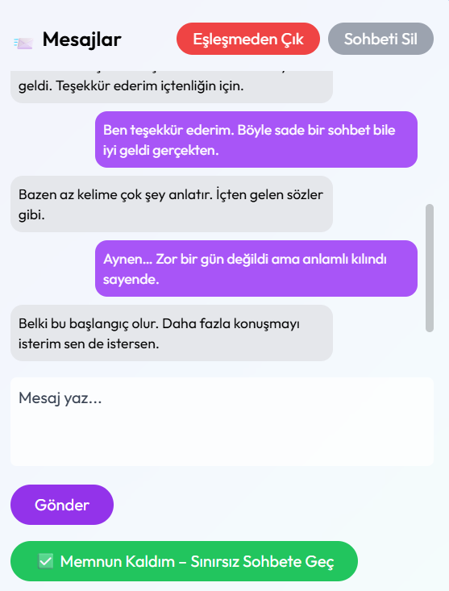
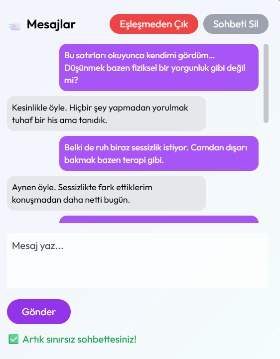
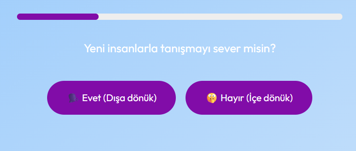
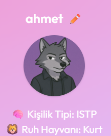
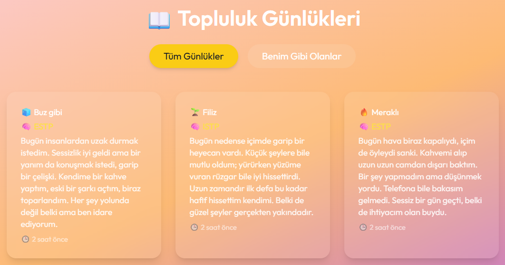
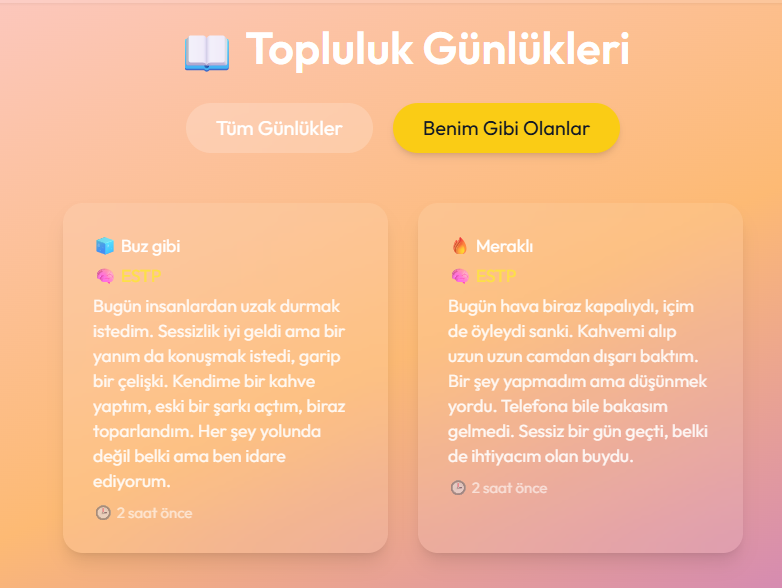

# 🧩 Matchora | Anonim Günlük ve Eşleşme Platformu  
### MBTI tabanlı sosyal etkileşim uygulaması | Personality-based social diary platform

---

## 📌 Açıklama | Description

Matchora, kullanıcıların MBTI tarzı kişilik analizine göre eşleştiği, anonim günlükler paylaşabildiği ve birbirleriyle etkileşime geçebildiği bir web uygulamasıdır.  
Kullanıcılar yalnızca bir yorum yapabilir, günlük sahibi yorumu beğenirse eşleşme başlar. Eşleşen kullanıcılar 5 mesaj sınırına sahiptir, iki taraf da memnun kalırsa sohbet sınırsız hale gelir.

Matchora is a web app where users are anonymously matched based on MBTI-style personality types. They can share daily emotion-driven diary entries and comment once per diary. If the diary owner likes the comment, a match is created. Matched users can exchange 5 limited messages, and if both approve, unlimited messaging is unlocked.

---

## ⚙️ Kullanılan Teknolojiler | Technologies Used

- **Frontend:** React, TailwindCSS  
- **Backend:** Node.js, Express.js, MongoDB  
- **Realtime:** Socket.io  
- **Auth:** JWT  
- **Other:** Toasts, Modals, Responsive UI

---

## 🔍 Özellikler | Features

- ✅ Kişilik testi ile eşleşme | Personality matching via MBTI
- ✅ Anonim günlük yazımı | Anonymous diary writing
- ✅ Yorum ve eşleşme sistemi | Comment and match system
- ✅ Gerçek zamanlı mesajlaşma | Real-time messaging
- ✅ Sınırlı & sınırsız sohbet mantığı | Limited & unlocked chat logic
- ✅ Bildirimler ve kullanıcı paneli | Notifications & user profile

---

---

## 📷 Ekran Görüntüleri | Screenshots

### 💬 Sınırlı Mesaj Ekranı | Limited Chat Screen

### 🔓 Sınırsız Mesaj Ekranı | Unlocked Chat Screen

### 🧠 Kişilik Testi Sorusu | Personality Test Question

### 🧬 Kişilik Sonucu ve Ruh Hayvanı | Personality Result & Spirit Animal

### 🗃️ Topluluk Günlük Kartları | Diary Cards in Explore

### 🧩 “Benim Gibi Olanlar” Sayfası | "People Like Me" Section

